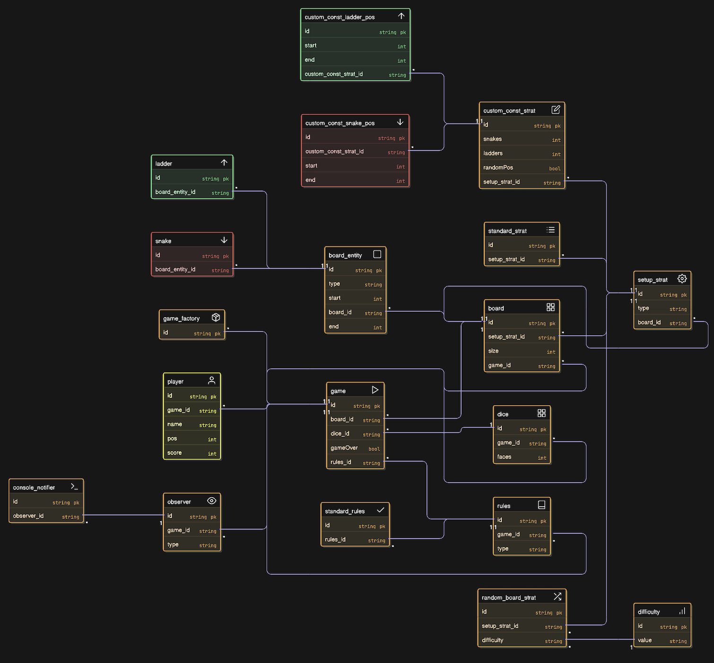

# Snakes & Ladders — Architecture & Design Documentation

## Table of Contents
1. [Overview](#overview)  
2. [System Features](#system-features)  
3. [Class Diagram](#class-diagram)  
4. [Design Patterns Used](#design-patterns-used)  
5. [Component-Level Details](#component-level-details)  
6. [Gameplay Workflow](#gameplay-workflow)  

---

## Overview
This project implements a fully modular, extensible **Snakes & Ladders game in C++**, designed with clean OOP principles and multiple design patterns.  
The system supports:

- Multiple board setup strategies  
- Custom, random, and standard configurations  
- Observer-based notifications  
- Multiple players  
- Pluggable rules  

The goal of the architecture is to allow flexible extension—for example, additional rules, new board strategies, or UI-based observers—without modifying core logic.

---

## System Features

### **1. Multiple Board Setup Strategies**
- **Standard strategy** → canonical 10×10 board  
- **Random strategy** → difficulty-based snake/ladder distribution  
- **Custom strategy**  
  - Random placement using custom counts  
  - Exact user-defined positions  

### **2. Observer Notifications**
The game publishes events (moves, encounters, wins) to all observers.  
Default implementation: **SnakeAndLadderConsoleNotifier**

### **3. Strategy-Based Game Rules**
Rules for:
- Move validity  
- Snake/ladder traversal  
- Win condition  

Handled by `SnakeAndLadderRules` and its derivative `StandardSnakeAndLadderRules`.

### **4. Clean Player Abstraction**
Each player has:
- Name  
- Current position  
- Win count  

### **5. Factory for Game Creation**
`SnakeAndLadderGameFactory` builds:
- Standard game  
- Random game  
- Custom game  

---

## Class Diagram

The following diagram shows all major system components and relationships:

> **Class Diagram:**  
> 

---

## Design Patterns Used

### **1. Observer Pattern**
Used to broadcast game events to any number of observers.

**Subject:**  
- `SnakeAndLadderGame`

**Observers:**  
- `IObserver` interface  
- `SnakeAndLadderConsoleNotifier`

This makes logging and UI updates plug-and-play.

---

### **2. Strategy Pattern**
Used in two major subsystems:

#### (a) Board Setup Strategy  
- `BoardSetupStrategy` (abstract)  
- `RandomBoardSetupStrategy`  
- `CustomCountBoardSetupStrategy`  
- `StandardBoardSetupStrategy`  

Allows dynamic selection of board initialization logic.

#### (b) Game Rules Strategy  
- `SnakeAndLadderRules`  
- `StandardSnakeAndLadderRules`  

Allows different move/win interpretations.

---

### **3. Factory Pattern**
`SnakeAndLadderGameFactory` helps construct a game without directly exposing creation details:

- `createStandardGame()`  
- `createRandomGame(boardSize, difficulty)`  
- `createCustomGame(boardSize, strategy)`  

This keeps main logic clean and encourages modularity.

---

## Component-Level Details

### **1. IObserver & SnakeAndLadderConsoleNotifier**
Defines event-handling wrappers to print or extend notifications.

```cpp
class IObserver { 
public:
    virtual void update(string msg) = 0; 
};
```

## **2. Dice**
Encapsulates dice face count and random rolling.

- `faces: int`
- `roll(): int`

---

## *32. Board & BoardEntity**

### **Board**
Stores:
- `totalCells`
- `snakes: List<Snake>`
- `ladders: List<Ladder>`
- `entityMap: Map<Int, BoardEntity>` (fast lookup)

### **BoardEntity (abstract)**
- `startIndex`
- `endIndex`

### **Snake extends BoardEntity**
### **Ladder extends BoardEntity**

---

## **4. Board Setup Strategies**

### **Random Strategy**
- Difficulty-based snake probabilities  
- Random count placement  
- Avoid overlapping entities

### **Custom Strategy**
- User-defined snakes/ladders

### **Standard Strategy**
- Classic snake & ladder layout

Each implements:
- `apply(board: Board): Board`

---

## **5. Player**

### **SnakeAndLadderPlayer**
Stores:
- `id`
- `name`
- `currentPosition`
- `winCount`

---

## **6. Game Rules**

### **SnakeAndLadderRules**
Controls:
- Move validation
- Boundary checks
- Snake/ladder traversal
- Win condition

### **StandardSnakeAndLadderRules**
Default implementation:
- Exact landing needed to win  
- Automatically apply snake/ladder effect

---

## **7. SnakeAndLadderGame**

Coordinates gameplay:
- Manages board
- Rolls dice
- Tracks turn order (`Deque<Player>`)
- Broadcasts events
- Uses rule strategy

Responsibilities:
- `startGame()`
- `playTurn()`
- `applyRules()`
- `notifyObservers()`

---

## **8. Game Factory**

Builds entire game setup:
- Board creation
- Strategy application
- Dice initialization
- Players added
- Observers attached

Zero redundant logic in main game loop.

---

## **9. Gameplay Workflow**

1. Player chooses configuration  
   - Standard  
   - Random  
   - Custom  

2. Factory builds game  
3. Board is created  
4. Strategy applied  
5. Dice initialized  
6. Players added  
7. Observers attached  
8. Game loop begins  
   - Roll  
   - Validate move  
   - Apply snakes/ladders  
   - Notify observers  
   - Check win  
9. Game ends when player reaches final cell  

